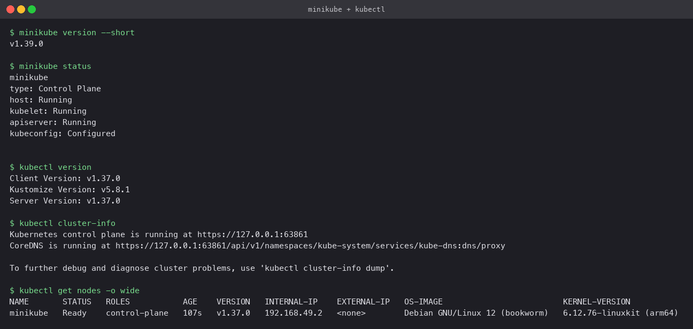
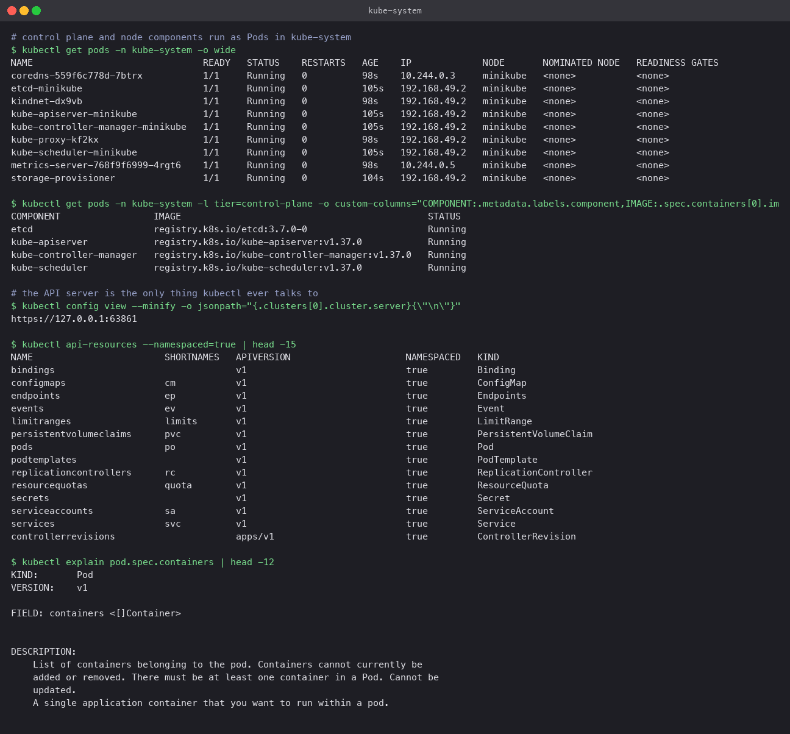
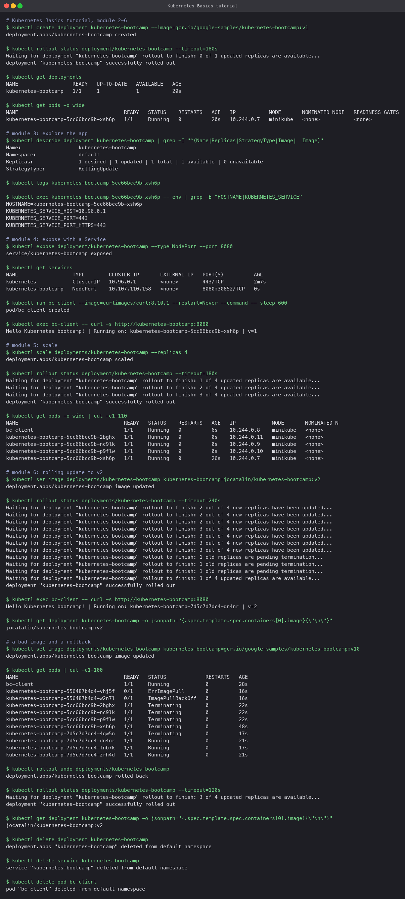

# Kubernetes Fundamentals

**Name:** Rajveer Bishnoi
**Enrollment Number:** 24BCS10404

Setting up a local cluster, checking it is healthy, reading how the pieces fit together, and
working through the official Kubernetes Basics tutorial end to end.

## 1. Install and start Minikube

Minikube runs a single-node Kubernetes cluster inside a container or VM. On this Mac it uses
the Docker driver, so the "node" is a Docker container running kubelet, containerd and the
control plane.

```bash
brew install minikube kubectl
minikube start --driver=docker --cpus=3 --memory=4096
minikube addons enable metrics-server
minikube addons enable ingress
```

`minikube start` downloads a base image, creates the node container, bootstraps the control
plane with kubeadm and writes a context into `~/.kube/config` so `kubectl` points at it.

## 2. Verify the cluster

```bash
minikube version --short
minikube status
kubectl version
kubectl cluster-info
kubectl get nodes -o wide
```

`minikube status` reports the host, kubelet and API server as `Running`. `kubectl cluster-info`
shows the API server endpoint (a local port that Minikube forwards into the node) and the
CoreDNS proxy URL. `kubectl get nodes` lists one node, `minikube`, in `Ready` state, running
Kubernetes v1.37.0 on containerd.



## 3. Architecture

Kubernetes is a control loop. You declare the state you want in the API server, controllers
notice the difference between desired and actual state, and they act to close the gap.

**Control plane** (on the single node here, normally on dedicated machines):

| Component | Job |
|---|---|
| `kube-apiserver` | The front door. Every `kubectl` command, every controller and every kubelet talks to it over REST. It validates requests and persists them. |
| `etcd` | Key-value store holding all cluster state. The only stateful component. |
| `kube-scheduler` | Watches for Pods with no node assigned and picks one based on resources, affinity and taints. |
| `kube-controller-manager` | Runs the built-in controllers: ReplicaSet, Deployment, Node, Job, EndpointSlice and so on. |

**Node components** (on every node):

| Component | Job |
|---|---|
| `kubelet` | Agent that makes the Pods assigned to its node actually run, via the container runtime. Reports status back. |
| `kube-proxy` | Programs iptables or IPVS rules so Service IPs route to Pod IPs. |
| Container runtime | containerd here. Pulls images and runs containers. |
| `coredns` | Cluster DNS. Resolves `service.namespace.svc.cluster.local` to Service IPs. |

All of these except kubelet and containerd run as Pods in the `kube-system` namespace, which
is why `kubectl get pods -n kube-system` is a good first look at any cluster. The control
plane Pods carry a `tier=control-plane` label.

```bash
kubectl get pods -n kube-system -o wide
kubectl get pods -n kube-system -l tier=control-plane -o custom-columns=COMPONENT:.metadata.labels.component,IMAGE:.spec.containers[0].image,STATUS:.status.phase
kubectl config view --minify -o jsonpath='{.clusters[0].cluster.server}'
kubectl api-resources --namespaced=true | head
kubectl explain pod.spec.containers
```

`kubectl api-resources` lists every object kind the API server knows about, with short names
(`po`, `svc`, `deploy`). `kubectl explain` prints the schema for any field, which is faster
than searching the docs.



## 4. Core objects and commands

| Object | What it is | Typical commands |
|---|---|---|
| Pod | One or more containers sharing a network namespace and volumes. The unit Kubernetes schedules. | `kubectl get pods -o wide`, `kubectl describe pod X`, `kubectl logs X`, `kubectl exec X -- cmd` |
| ReplicaSet | Keeps N identical Pods running. Rarely created by hand. | `kubectl get rs` |
| Deployment | Manages ReplicaSets to give you rolling updates and rollbacks. | `kubectl create deployment`, `kubectl scale`, `kubectl set image`, `kubectl rollout status/undo/history` |
| Service | Stable IP and DNS name in front of a set of Pods. | `kubectl expose`, `kubectl get svc` |
| Namespace | Logical partition of the cluster. | `kubectl get ns`, `-n <ns>` on any command |
| ConfigMap / Secret | Configuration and credentials injected into Pods. | `kubectl create configmap`, `kubectl get secret` |

Commands that work on everything: `kubectl get`, `describe`, `apply -f`, `delete`, `explain`,
`-o yaml`, `-o wide`, `-o jsonpath=...`, `--watch`.

## 5. Kubernetes Basics tutorial, hands on

The tutorial's modules 2 to 6, run against this cluster. The bootcamp image replies with
its Pod name and version, which makes scaling and updates visible.

```bash
# module 2: deploy
kubectl create deployment kubernetes-bootcamp --image=gcr.io/google-samples/kubernetes-bootcamp:v1
kubectl get deployments
kubectl get pods -o wide

# module 3: explore
kubectl describe deployment kubernetes-bootcamp
kubectl logs <pod>
kubectl exec <pod> -- env

# module 4: expose
kubectl expose deployment/kubernetes-bootcamp --type=NodePort --port 8080
kubectl get services
kubectl run bc-client --image=curlimages/curl:8.10.1 --restart=Never --command -- sleep 600
kubectl exec bc-client -- curl -s http://kubernetes-bootcamp:8080

# module 5: scale
kubectl scale deployments/kubernetes-bootcamp --replicas=4
kubectl get pods -o wide

# module 6: update and roll back
kubectl set image deployments/kubernetes-bootcamp kubernetes-bootcamp=jocatalin/kubernetes-bootcamp:v2
kubectl rollout status deployments/kubernetes-bootcamp
kubectl set image deployments/kubernetes-bootcamp kubernetes-bootcamp=gcr.io/google-samples/kubernetes-bootcamp:v10
kubectl get pods
kubectl rollout undo deployments/kubernetes-bootcamp
```

What the run showed:

- One Deployment produced one Pod with its own IP on the Pod network (`10.244.0.x`).
- Inside the Pod, environment variables `KUBERNETES_SERVICE_HOST` and `_PORT` are injected
  automatically, which is how in-cluster clients find the API server.
- `kubectl expose` created a NodePort Service. A client Pod reached the app by the Service name
  and got `Hello Kubernetes bootcamp! ... v=1`.
- Scaling to 4 created three more Pods under the same ReplicaSet in a few seconds.
- `kubectl set image` to v2 triggered a rolling update. The status output shows new replicas
  coming up while old ones are still pending termination. Afterwards the reply said `v=2`.
- Setting a non-existent tag (`v10`) produced Pods stuck in `ErrImagePull` and
  `ImagePullBackOff`, but the healthy v2 Pods kept serving. `kubectl rollout undo` reverted
  the image to v2 and the bad Pods were removed.



## Cleanup

```bash
kubectl delete deployment kubernetes-bootcamp
kubectl delete service kubernetes-bootcamp
kubectl delete pod bc-client
```
