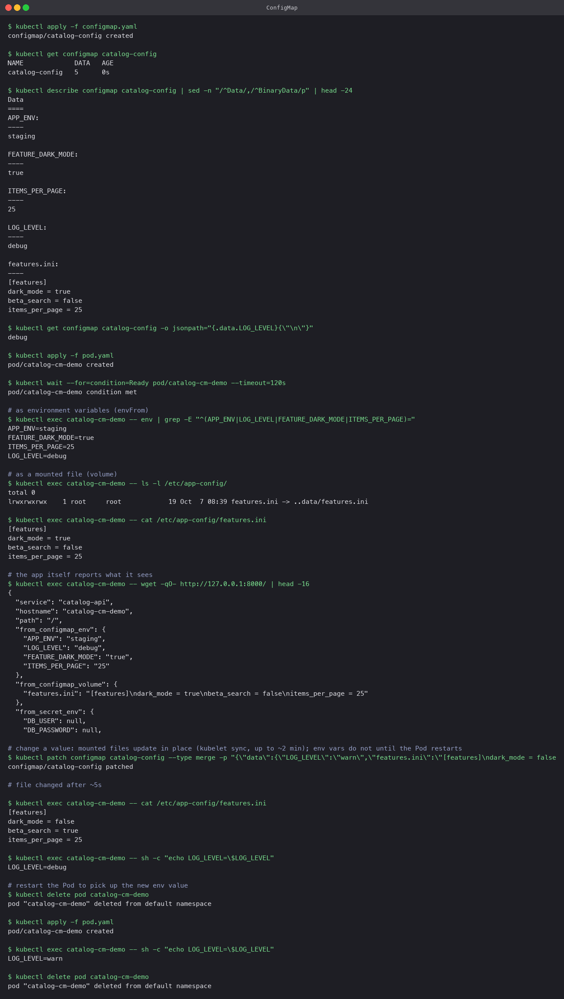

# ConfigMap

A ConfigMap holds non-secret configuration as key/value pairs so the same container image
can run in every environment with different settings. Two ways to consume it, both shown
here: environment variables and mounted files.

## Manifest

`configmap.yaml` mixes both styles. Four short keys become env vars; `features.ini` is a
whole file:

```yaml
data:
  APP_ENV: "staging"
  LOG_LEVEL: "debug"
  FEATURE_DARK_MODE: "true"
  ITEMS_PER_PAGE: "25"
  features.ini: |
    [features]
    dark_mode = true
    ...
```

`pod.yaml` consumes it with `envFrom.configMapRef` (every key becomes an env var) and a
`configMap` volume that mounts only `features.ini` at `/etc/app-config/`.

## Commands

```bash
kubectl apply -f configmap.yaml
kubectl get configmap catalog-config
kubectl describe configmap catalog-config
kubectl get configmap catalog-config -o jsonpath='{.data.LOG_LEVEL}'

kubectl apply -f pod.yaml
kubectl exec catalog-cm-demo -- env | grep -E '^(APP_ENV|LOG_LEVEL|FEATURE_DARK_MODE|ITEMS_PER_PAGE)='
kubectl exec catalog-cm-demo -- cat /etc/app-config/features.ini
kubectl exec catalog-cm-demo -- wget -qO- http://127.0.0.1:8000/

kubectl patch configmap catalog-config --type merge -p '{"data":{"LOG_LEVEL":"warn", ...}}'
```

## What the run showed

- `describe` lists the five keys with their values in clear text. ConfigMaps hide nothing.
- Inside the container all four env vars were present, and the mounted path contained
  `features.ini` as a symlink into a `..data` directory. That symlink is how Kubernetes swaps
  the whole file set atomically on update.
- The app's own `/` endpoint echoed both the env values and the file content, which confirms
  the application, not just the shell, sees them.
- After patching the ConfigMap, the mounted file changed within a few seconds (kubelet checks
  on its sync period, so this can take up to a minute or two). The env var did **not** change;
  env vars are read once at process start. Recreating the Pod picked up `LOG_LEVEL=warn`.

That last point is the practical rule: use a volume mount when the app can re-read config at
runtime; use env vars when a restart on change is acceptable. A Deployment restarts Pods for
you if you change a hash annotation on the Pod template, or with `kubectl rollout restart`.


