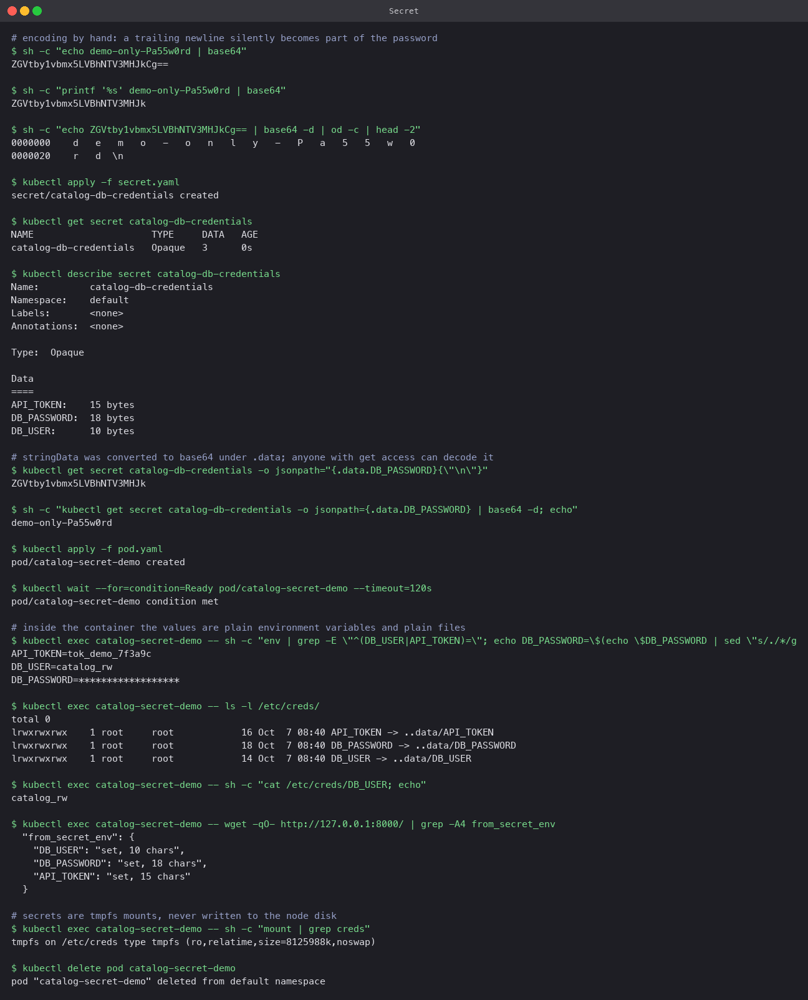

# Secret

A Secret is the object for credentials, tokens and keys. Structurally it is a ConfigMap whose
values are base64-encoded and which the cluster treats a little more carefully: it can be
encrypted at rest in etcd, it is mounted on tmpfs rather than disk, and `describe` hides the
values. It is **not** encrypted by default, and base64 is not encryption.

## Manifest

`secret.yaml` uses `stringData` so the file is readable; the API server converts it to
base64 under `data` on write. `pod.yaml` maps each key to an env var with `secretKeyRef` and
also mounts the Secret as files at `/etc/creds` with mode `0400`.

## Encoding by hand

If you write `data:` directly you must base64 the values yourself, and the classic mistake is
a trailing newline:

```bash
echo demo-only-Pa55w0rd | base64          # ZGVtby1vbmx5LVBhNTV3MHJkCg==   <- "Cg==" is "\n"
printf '%s' demo-only-Pa55w0rd | base64   # ZGVtby1vbmx5LVBhNTV3MHJk       <- correct
```

The run decodes the first form with `od -c` and the `\n` is right there at the end. A database
would reject that password and nothing in Kubernetes would tell you why. `printf '%s'` (or
`echo -n` in shells that support it) avoids it; `stringData` avoids the whole problem.

## Commands

```bash
kubectl apply -f secret.yaml
kubectl get secret catalog-db-credentials
kubectl describe secret catalog-db-credentials
kubectl get secret catalog-db-credentials -o jsonpath='{.data.DB_PASSWORD}' | base64 -d

kubectl apply -f pod.yaml
kubectl exec catalog-secret-demo -- env | grep -E '^(DB_USER|API_TOKEN)='
kubectl exec catalog-secret-demo -- ls -l /etc/creds/
kubectl exec catalog-secret-demo -- sh -c 'mount | grep creds'
```

## What the run showed

- `describe` prints only byte counts (`DB_PASSWORD: 18 bytes`). Shoulder-surfing safe.
- `get -o jsonpath` plus `base64 -d` printed the password in clear text. Anyone with `get`
  on Secrets in the namespace can do this, so RBAC on Secrets is the actual access control.
- Inside the container the values are ordinary env vars and ordinary files. The app reported
  all three as set. The mount is `tmpfs`, so the plaintext lives in memory, not on the node's
  disk.

## Why Secrets must not be committed to Git as-is

- base64 is reversible by anyone who can read the repository. A committed Secret is a
  committed password.
- Git history is forever. Rotating the credential does not remove the old one from every
  clone and fork.
- Scanners (GitHub secret scanning, gitleaks, trufflehog) will flag it, and so will attackers
  running the same tools against public repos within minutes.

What to do instead, in increasing order of rigour: keep Secret manifests out of the repo
and create them with `kubectl create secret ... --from-literal` or `--from-file` from a
vault; commit them encrypted with SOPS or Sealed Secrets, which can only be decrypted by the
cluster; or use External Secrets Operator to sync from AWS Secrets Manager, Vault or similar
at runtime. The values in this folder are placeholders that exist only to make the demo
self-contained.


