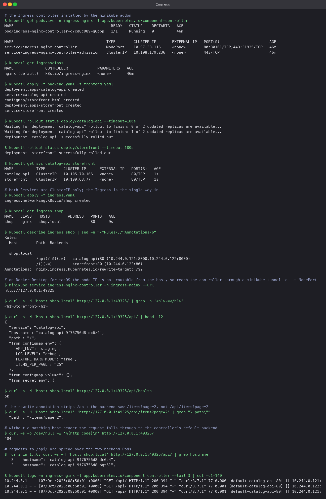
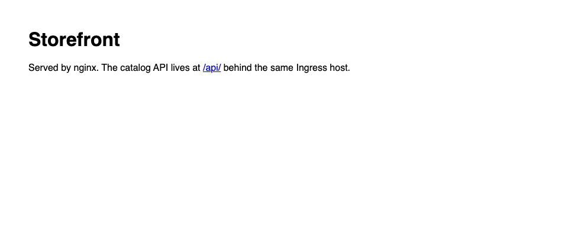
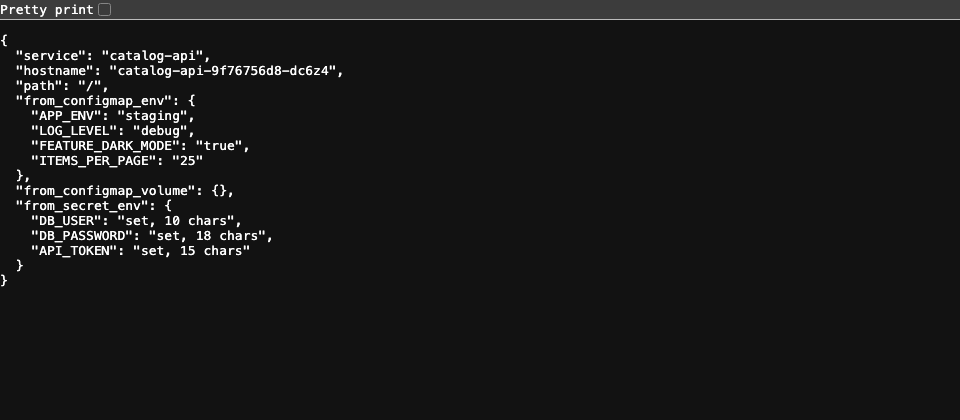

# Ingress

Two ClusterIP Services, one hostname. The Ingress resource holds the routing rules; the
ingress-nginx controller (installed by `minikube addons enable ingress`) turns them into a
running reverse proxy.

## Manifests

- `backend.yaml`: `catalog-api` Deployment (2 replicas) with the ConfigMap and Secret
  injected, plus a ClusterIP Service on port 80 -> 8000.
- `frontend.yaml`: an nginx `storefront` serving a page from a ConfigMap, plus its Service.
- `ingress.yaml`: host `shop.local`, two paths:

```yaml
- path: /api(/|$)(.*)   -> catalog-api:80   (with rewrite-target: /$2, so /api/health becomes /health)
- path: /()(.*)         -> storefront:80
```

Both paths use `ImplementationSpecific` with regex because the rewrite annotation needs
capture groups. Without a rewrite the backend would receive `/api/health` and 404.

## Commands

```bash
kubectl get pods,svc -n ingress-nginx
kubectl get ingressclass
kubectl apply -f backend.yaml -f frontend.yaml
kubectl apply -f ingress.yaml
kubectl get ingress shop
kubectl describe ingress shop

minikube service ingress-nginx-controller -n ingress-nginx --url     # on macOS
curl -H 'Host: shop.local' http://127.0.0.1:<port>/
curl -H 'Host: shop.local' http://127.0.0.1:<port>/api/
curl -H 'Host: shop.local' http://127.0.0.1:<port>/api/health
```

## What the run showed

- `describe ingress` listed both backends with their Pod IPs resolved, which means the
  controller found the Services and their endpoints.
- With the Docker driver on macOS the node IP is not reachable from the laptop, so the
  controller's NodePort was reached through a `minikube service --url` tunnel. On Linux the
  address in `kubectl get ingress` works directly.
- `/` returned the storefront page. `/api/` returned the API's JSON, with the ConfigMap values
  and the Secret keys present, proving the Deployment's injection too. `/api/health` returned
  `ok`, so the rewrite stripped the prefix.
- A request with no `Host: shop.local` header got `404` from the controller's default backend.
  Host-based routing is strict.
- Six requests to `/api/` were spread across both backend Pods, so the Ingress load-balances
  through the Service as expected.
- The controller access log shows each request with the upstream it chose
  (`[default-catalog-api-80]`), which is the first place to look when routing misbehaves.



Browser, with `shop.local` pointed at the tunnel:



