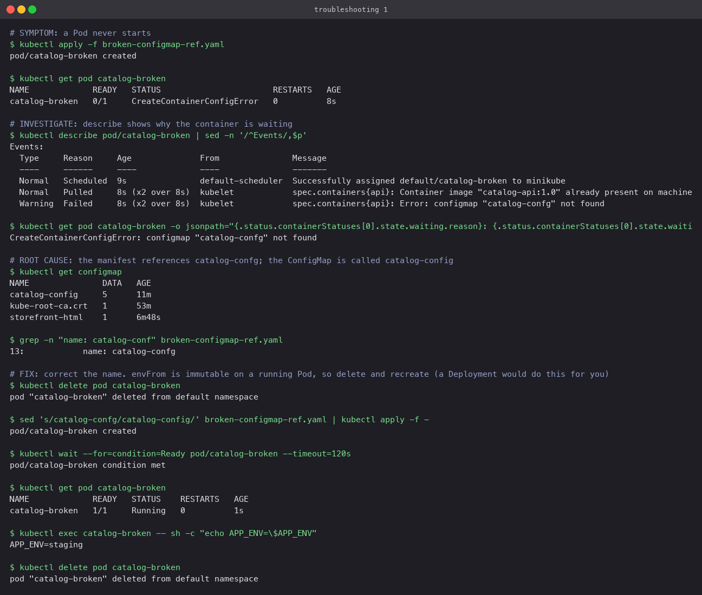
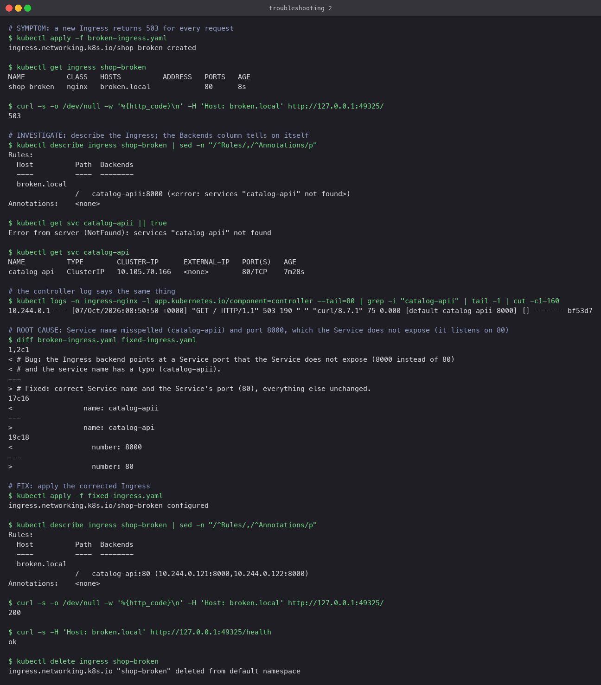

# Troubleshooting

Two manifests that are broken on purpose. For each: the symptom, the commands that found the
cause, the cause, the fix, and the before/after output.

## Scenario 1: Pod stuck in CreateContainerConfigError

**Symptom.** `broken-configmap-ref.yaml` is applied and the Pod shows
`CreateContainerConfigError`, never `Running`.

**Investigation.** `kubectl describe pod` events: `Error: configmap "catalog-confg" not found`.
The same text is in `status.containerStatuses[0].state.waiting.message`. `kubectl get configmap`
lists `catalog-config`.

**Root cause.** A typo in `envFrom.configMapRef.name`. kubelet cannot build the container's
environment, so it never starts the container. The image is fine, the node is fine.

**Fix.** Correct the name. Because `envFrom` is immutable on an existing Pod, delete and
recreate it (a Deployment would roll a new Pod automatically). Afterwards the Pod is
`1/1 Running` and `APP_ENV=staging` is present.

## Scenario 2: Ingress returns 503 for everything

**Symptom.** `broken-ingress.yaml` is applied and every request to `broken.local` returns
`503 Service Temporarily Unavailable`.

**Investigation.** `kubectl describe ingress shop-broken` shows the backend as
`catalog-apii:8000 (<error: services "catalog-apii" not found>)`. `kubectl get svc catalog-apii`
confirms there is no such Service. The controller's access log tags the request with upstream
`[default-catalog-apii-8000]` and no endpoint.

**Root cause.** Two mistakes in the backend reference: the Service name is misspelled, and
the port is `8000` (the container port) instead of `80` (the Service port). The Ingress
backend must name a Service port, not a Pod port.

**Fix.** `fixed-ingress.yaml` corrects both lines; `diff` shows nothing else changed. After
applying, `describe` resolves the backend to the two API Pods, `/` returns `200` and
`/health` returns `ok`.

## General approach

1. `kubectl get` to see the state, `kubectl describe` to see the events. Nine times out of
   ten the event text names the problem.
2. For Pods: `CreateContainerConfigError` is a missing ConfigMap or Secret reference;
   `ImagePullBackOff` is the image; `CrashLoopBackOff` is the process, read `kubectl logs`.
3. For Ingress: check `describe ingress` resolves every backend to endpoints, then
   `kubectl get svc` and `kubectl get endpointslices` for the Service it names, then the
   controller logs in `ingress-nginx`.
4. Fix the manifest, not the live object, so the fix survives the next apply.
