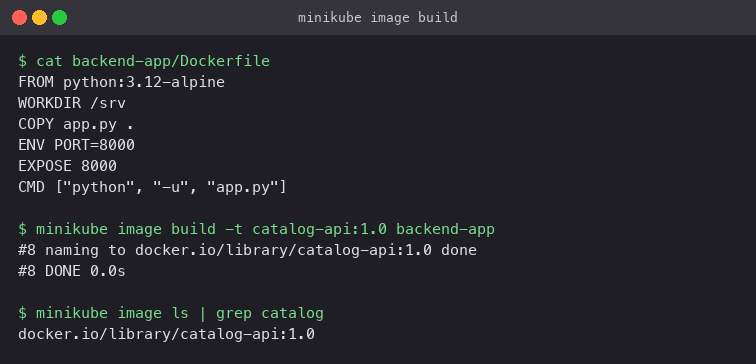

# Kubernetes Ingress, ConfigMaps and Secrets

**Name:** Rajveer Bishnoi
**Enrollment Number:** 24BCS10404

A small two-tier app (`storefront` static site plus a `catalog-api` backend) used to show
how configuration and credentials get into Pods and how one Ingress exposes both tiers on a
single hostname. Every step was run on Minikube with the `ingress` addon.

| Folder | Covers |
|---|---|
| [backend-app/](backend-app/) | The API image. A 60-line Python server that reports which config it received and from where |
| [01-configmap/](01-configmap/) | Create a ConfigMap, inject it as env vars and as a mounted file, change it live |
| [02-secret/](02-secret/) | Create a Secret, inject it as env vars and files, decode it, and why that matters for Git |
| [03-ingress/](03-ingress/) | Deploy both tiers, route `/` and `/api/` through one Ingress host, verify from node, tunnel and browser |
| [04-troubleshooting/](04-troubleshooting/) | Two deliberately broken manifests, diagnosed and fixed with before/after output |
| [ingress-vs-controller.md](ingress-vs-controller.md) | What an Ingress is, what an Ingress Controller is, and why you need both |

## The image

`backend-app/app.py` listens on 8000 and answers `/` with JSON containing the ConfigMap env
vars, the mounted config files, and whether each Secret key is set (length only, never the
value). `/health` returns `ok` for the readiness probe. It was built straight into Minikube's
image store so no registry is involved:

```bash
minikube image build -t catalog-api:1.0 backend-app
```



## Order to run things

```bash
kubectl apply -f 01-configmap/configmap.yaml
kubectl apply -f 02-secret/secret.yaml
kubectl apply -f 03-ingress/backend.yaml -f 03-ingress/frontend.yaml -f 03-ingress/ingress.yaml
```

The Pod demos in `01-configmap/pod.yaml` and `02-secret/pod.yaml` are standalone and can be
applied and deleted independently.

## Cleanup

```bash
kubectl delete -f 03-ingress -f 02-secret/secret.yaml -f 01-configmap/configmap.yaml
```
