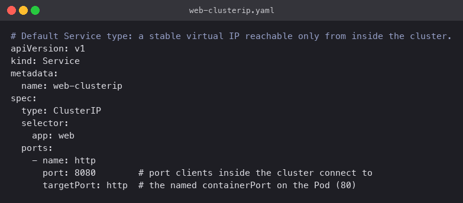
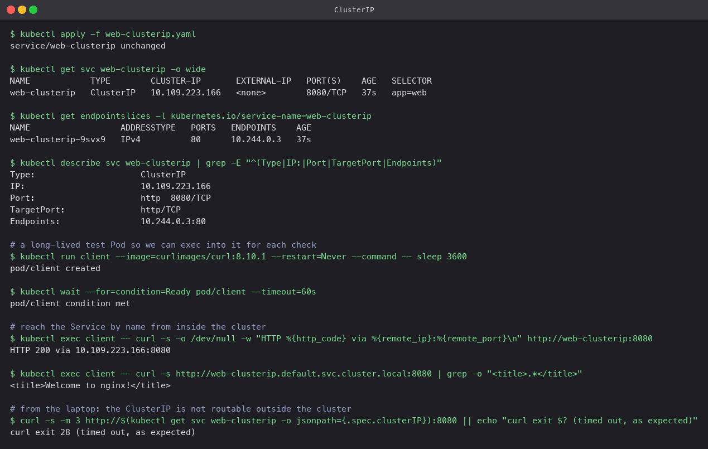

# ClusterIP

The default type. Kubernetes allocates a virtual IP from the service CIDR and kube-proxy
programs the node so that traffic to that IP and port is forwarded to one of the matching
Pods. The IP only exists inside the cluster; nothing outside can route to it.

Use it for anything that only other Pods need to call: a backend behind a frontend, a cache,
an internal API.

## Manifest

[`web-clusterip.yaml`](web-clusterip.yaml): selects `app: web`, listens on `8080`, forwards
to the Pod's `http` port (80).



## Commands

```bash
kubectl apply -f web-clusterip.yaml
kubectl get svc web-clusterip -o wide
kubectl get endpointslices -l kubernetes.io/service-name=web-clusterip
kubectl describe svc web-clusterip

# a long-lived Pod to test from
kubectl run client --image=curlimages/curl:8.10.1 --restart=Never --command -- sleep 3600
kubectl exec client -- curl -s -o /dev/null -w "HTTP %{http_code} via %{remote_ip}:%{remote_port}\n" http://web-clusterip:8080
kubectl exec client -- curl -s http://web-clusterip.default.svc.cluster.local:8080 | grep -o "<title>.*</title>"

# from the laptop
curl -s -m 3 http://$(kubectl get svc web-clusterip -o jsonpath='{.spec.clusterIP}'):8080
```

## What happened

- The Service got ClusterIP `10.109.223.166`. Its EndpointSlice lists `10.244.0.3` on port 80,
  which is the `web` Pod. The selector did its job.
- From the `client` Pod, `curl` to the short name `web-clusterip:8080` returned `HTTP 200`
  and `curl` reports it connected to `10.109.223.166:8080`, the virtual IP, not the Pod IP.
  The fully qualified name `web-clusterip.default.svc.cluster.local` works too and returned
  the Nginx welcome page.
- From the laptop the same IP timed out after three seconds. That is the point of ClusterIP.


