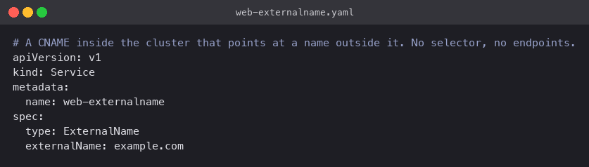
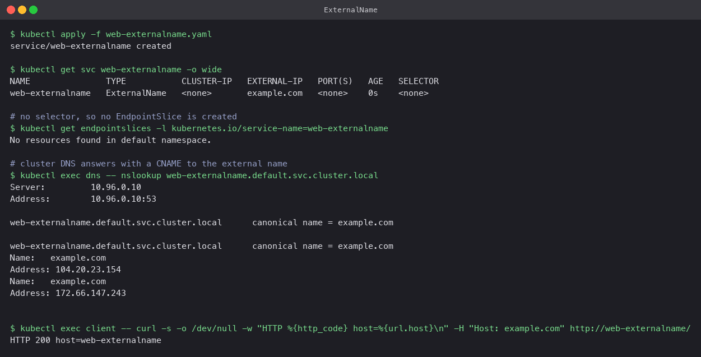

# ExternalName

An ExternalName Service has no selector, no ClusterIP and no EndpointSlice. It is purely a
DNS alias: cluster DNS answers `web-externalname.default.svc.cluster.local` with a CNAME
record pointing at whatever `externalName` says.

The use case is giving an outside dependency (a managed database, a third-party API) a
stable in-cluster name, so application config never changes when the real hostname does.

## Manifest

[`web-externalname.yaml`](web-externalname.yaml): `type: ExternalName`, `externalName: example.com`,
and nothing else.



## Commands

```bash
kubectl apply -f web-externalname.yaml
kubectl get svc web-externalname -o wide
kubectl get endpointslices -l kubernetes.io/service-name=web-externalname
kubectl exec dns -- nslookup web-externalname.default.svc.cluster.local
kubectl exec client -- curl -s -o /dev/null -w "HTTP %{http_code}\n" -H "Host: example.com" http://web-externalname/
```

## What happened

- `TYPE` is `ExternalName`, `CLUSTER-IP` is `<none>`, `EXTERNAL-IP` shows `example.com`, and
  `SELECTOR` is `<none>`. No EndpointSlice was created.
- `nslookup` returned `canonical name = example.com` followed by example.com's real A records
  (`104.20.23.154`, `172.66.147.243`). CoreDNS served the CNAME and the upstream resolver
  finished the chain.
- `curl` to `http://web-externalname/` returned 200. The `Host: example.com` header is needed
  because the connection goes to example.com's servers, which only serve their own hostname.
  That is a general caveat of ExternalName with HTTP: the alias rewrites DNS, not the request.


