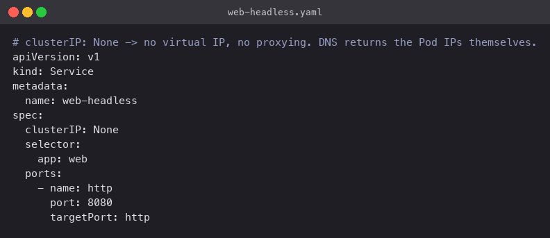
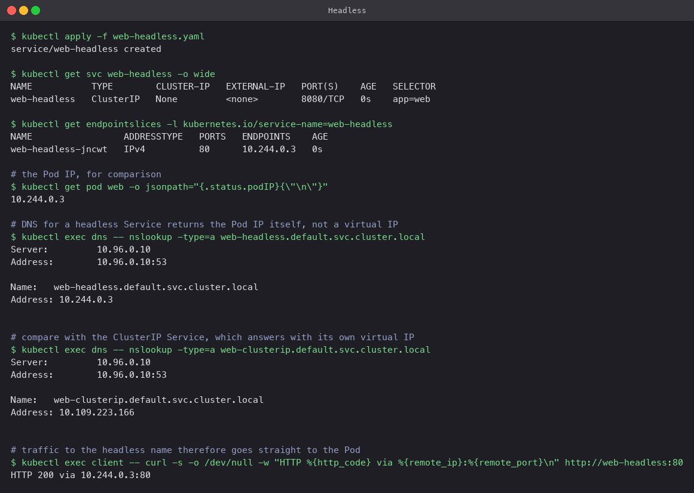

# Headless

Setting `clusterIP: None` turns off the virtual IP and kube-proxy entirely. The Service still
tracks matching Pods in an EndpointSlice, but DNS answers a lookup of the Service name with
the **Pod IPs themselves**. Clients connect straight to a Pod; nothing load-balances in between.

StatefulSets rely on this so that each replica (`db-0`, `db-1`, ...) has a stable DNS name,
and clients that need to pick a specific member (a database primary, a Kafka broker) can.

## Manifest

[`web-headless.yaml`](web-headless.yaml): no `type` line, `clusterIP: None`, same selector.



## Commands

```bash
kubectl apply -f web-headless.yaml
kubectl get svc web-headless -o wide
kubectl get endpointslices -l kubernetes.io/service-name=web-headless
kubectl get pod web -o jsonpath='{.status.podIP}'

kubectl run dns --image=busybox:1.36 --restart=Never --command -- sleep 3600
kubectl exec dns -- nslookup -type=a web-headless.default.svc.cluster.local
kubectl exec dns -- nslookup -type=a web-clusterip.default.svc.cluster.local   # for comparison
kubectl exec client -- curl -s -o /dev/null -w "HTTP %{http_code} via %{remote_ip}:%{remote_port}\n" http://web-headless:80
```

## What happened

- `CLUSTER-IP` is `None`. The EndpointSlice still exists and lists `10.244.0.3`.
- `nslookup web-headless.default.svc.cluster.local` returned `10.244.0.3`, which is exactly
  the Pod IP. The same lookup for `web-clusterip` returned `10.109.223.166`, the virtual IP.
  That one-line difference is the whole concept.
- `curl http://web-headless:80` connected to `10.244.0.3:80`, the Pod itself. Note the port:
  since there is no proxy, the Service's `port: 8080` has no effect on plain connections and
  the client talks to the container's real port. (`port` still matters for SRV records.)
- Busybox's `nslookup` is given `-type=a` and the fully qualified name so it does not also
  try AAAA and the search domains, which just adds noise.


