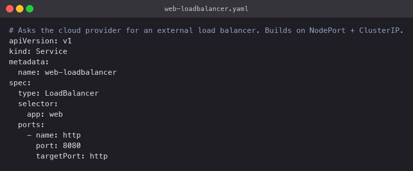
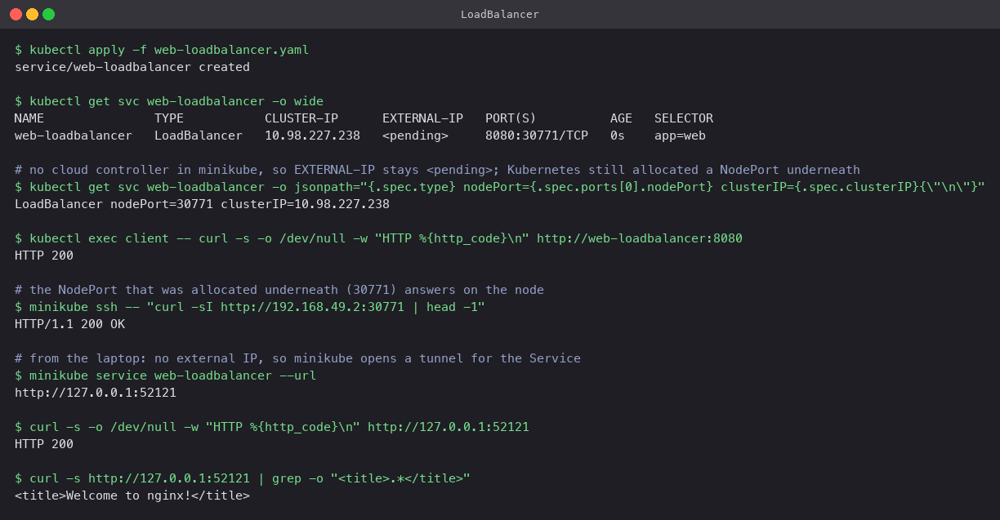

# LoadBalancer

`type: LoadBalancer` is how a Service gets a public IP on a cloud provider. Kubernetes
creates the ClusterIP and NodePort as usual, then asks the cloud controller manager for a
load balancer that forwards to that node port on every node. On AWS that is an ELB, on GCP a
forwarding rule, and so on.

## Manifest

[`web-loadbalancer.yaml`](web-loadbalancer.yaml): same selector and ports, `type: LoadBalancer`.



## Commands

```bash
kubectl apply -f web-loadbalancer.yaml
kubectl get svc web-loadbalancer -o wide
kubectl get svc web-loadbalancer -o jsonpath='{.spec.type} nodePort={.spec.ports[0].nodePort} clusterIP={.spec.clusterIP}'

kubectl exec client -- curl -s -o /dev/null -w "HTTP %{http_code}\n" http://web-loadbalancer:8080
minikube ssh -- "curl -sI http://192.168.49.2:30771 | head -1"
minikube service web-loadbalancer --url
```

## What happened

- `EXTERNAL-IP` is `<pending>` and stays that way. Minikube has no cloud controller, so
  nobody ever fulfils the request. This is expected on a local cluster and is not an error.
- Everything underneath still works: the Service has ClusterIP `10.98.227.238`, Kubernetes
  allocated node port `30771` automatically, `curl` from the `client` Pod returned 200, and
  `curl` from inside the node on port 30771 returned `HTTP/1.1 200 OK`.
- `minikube service --url` opened a tunnel to the node port and the page loaded in the
  browser. (`minikube tunnel` in a second terminal would go further and assign a real
  `EXTERNAL-IP`, but it needs `sudo` and was not required here.)



