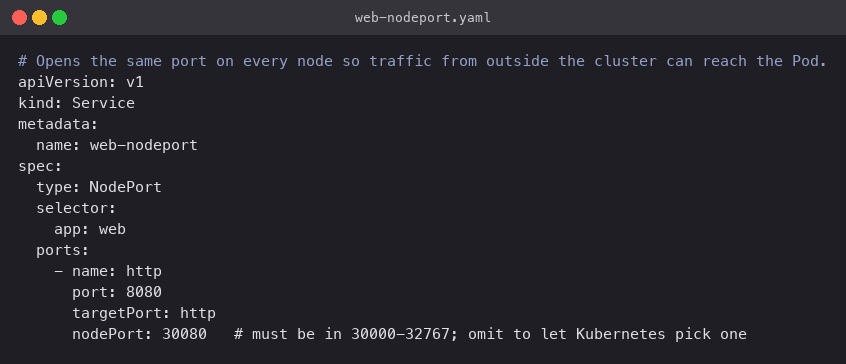
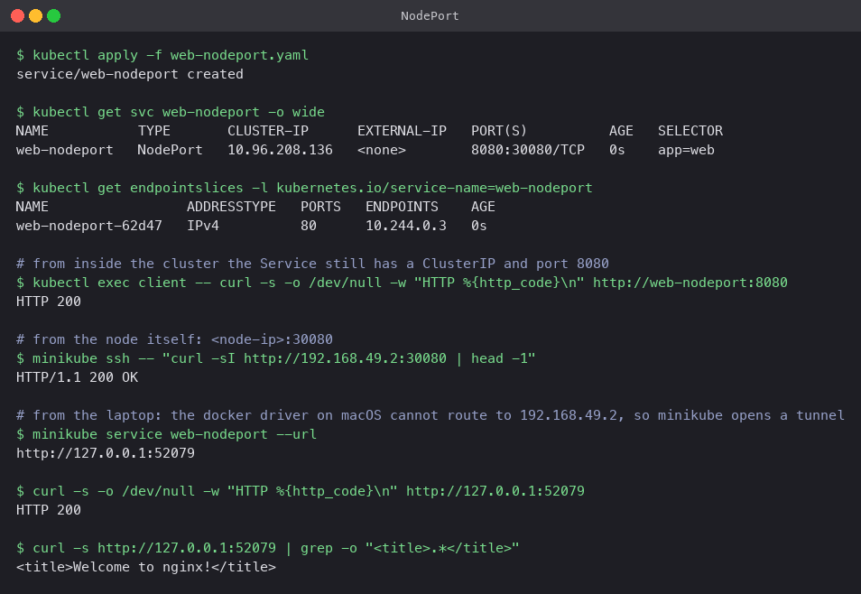
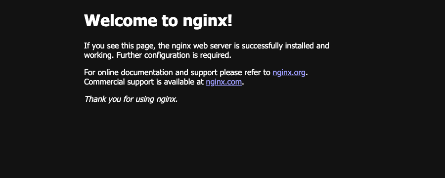

# NodePort

A NodePort Service is a ClusterIP Service plus one extra thing: kube-proxy opens a port in
the 30000-32767 range on **every** node and forwards it to the Service. Anyone who can reach
a node's IP can reach the app at `<node-ip>:<nodePort>`.

## Manifest

[`web-nodeport.yaml`](web-nodeport.yaml): same selector and ports as the ClusterIP Service,
with `type: NodePort` and a fixed `nodePort: 30080`. Leaving `nodePort` out lets Kubernetes
pick one.



## Commands

```bash
kubectl apply -f web-nodeport.yaml
kubectl get svc web-nodeport -o wide

# still works inside the cluster like a ClusterIP
kubectl exec client -- curl -s -o /dev/null -w "HTTP %{http_code}\n" http://web-nodeport:8080

# on the node, port 30080 is open
minikube ssh -- "curl -sI http://192.168.49.2:30080 | head -1"

# from the laptop
minikube service web-nodeport --url
```

## What happened

- `PORT(S)` shows `8080:30080/TCP`: port 8080 on the ClusterIP, port 30080 on the node.
- From inside the cluster the Service answers on `web-nodeport:8080` exactly like ClusterIP.
- From inside the node, `curl http://192.168.49.2:30080` returned `HTTP/1.1 200 OK`.
- From the laptop, the node IP `192.168.49.2` is not routable with the Docker driver on
  macOS (it lives inside Docker's VM). `minikube service --url` solves this by opening a
  tunnel and printing a `127.0.0.1` URL. The tunnel stays up while that command runs. `curl`
  on the tunnel URL returned 200 and the page loaded in the browser.



