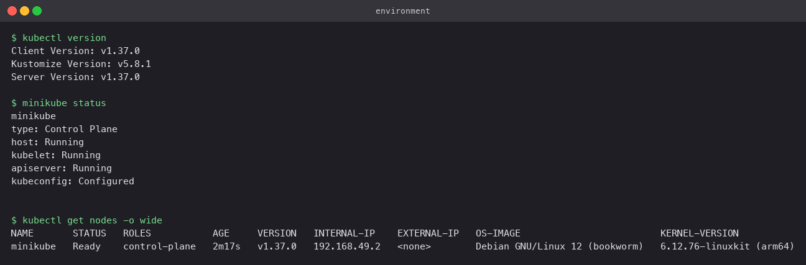
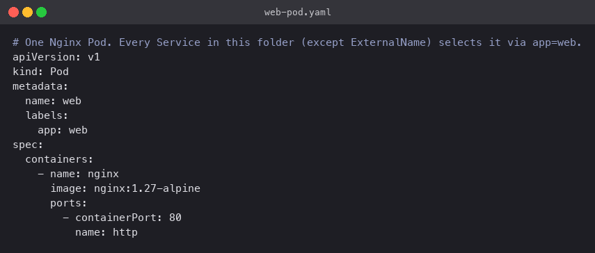
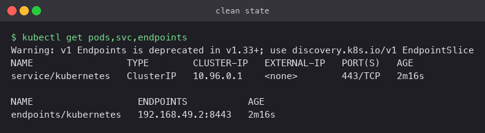
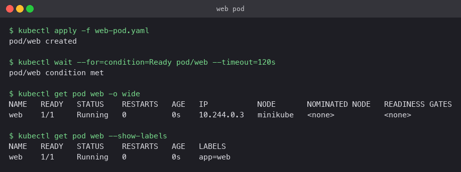
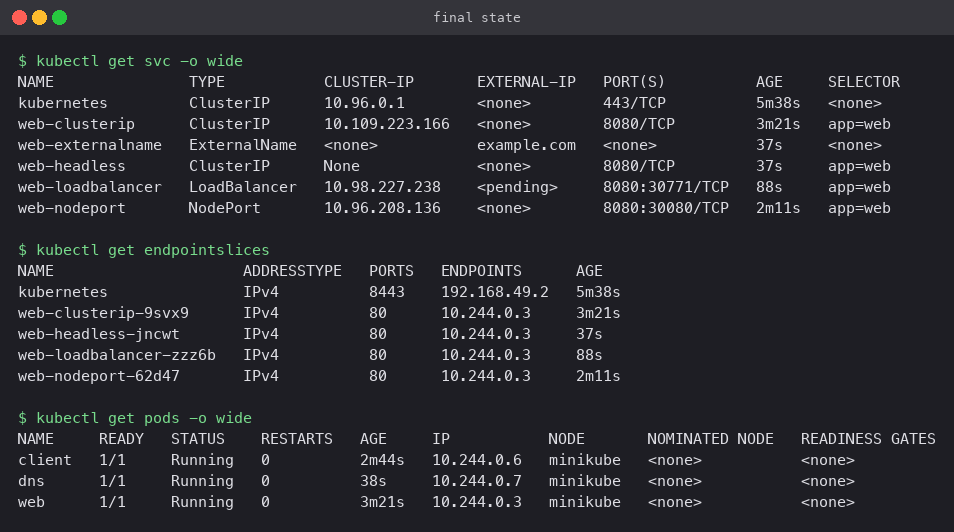
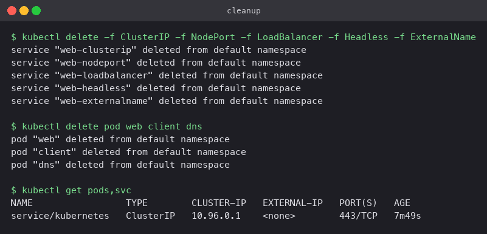

# Kubernetes Services

**Name:** Rajveer Bishnoi
**Enrollment Number:** 24BCS10404

The five Service types, each applied against the same single Nginx Pod and then verified
from wherever that type is supposed to be reachable: inside the cluster, from the node, from
the laptop, or through DNS.

**Environment:** Minikube v1.39 with the Docker driver on macOS (Apple silicon), Kubernetes
v1.37.0, containerd. The node's internal IP is `192.168.49.2` and the Pod landed on
`10.244.0.3`.



## The Pod

[`web-pod.yaml`](web-pod.yaml) runs `nginx:1.27-alpine` with a named container port `http`
(80) and the label `app: web`. Every selector-based Service below matches that label, and
`targetPort: http` refers to the port by name rather than by number.



Cluster before anything was applied, then the Pod running:




Two helper Pods were created once and reused for every check: `client`
(`curlimages/curl`) for HTTP and `dns` (`busybox`) for `nslookup`.

## The five types

| Folder | Service | Reachable from | Verified by |
|---|---|---|---|
| [ClusterIP](ClusterIP/) | `web-clusterip` | inside the cluster only | `curl` from the `client` Pod returned 200; `curl` from the laptop timed out |
| [NodePort](NodePort/) | `web-nodeport` `8080:30080` | any node IP on port 30080 | `curl` from inside the node, then a `minikube service` tunnel in the browser |
| [LoadBalancer](LoadBalancer/) | `web-loadbalancer` | an external IP from the cloud provider | `EXTERNAL-IP` stays `<pending>` on Minikube; the underlying NodePort and a tunnel both work |
| [Headless](Headless/) | `web-headless` (`clusterIP: None`) | by DNS, straight to Pod IPs | `nslookup` returned `10.244.0.3`, the Pod's own IP |
| [ExternalName](ExternalName/) | `web-externalname` | resolves to `example.com` | `nslookup` returned a CNAME to `example.com` |

Every folder has the manifest, a README with the commands and what they showed, and the
screenshots of the run.

## How they relate

ClusterIP is the base. NodePort is a ClusterIP plus a port opened on every node. LoadBalancer
is a NodePort plus a request to the cloud for an external IP that forwards to that node port.
That is why the `web-loadbalancer` Service still shows a ClusterIP and a `8080:30771` node
port even though no external IP ever arrived.

Headless and ExternalName are different in kind: neither gives you a virtual IP. Headless
hands out the Pod IPs directly through DNS; ExternalName hands out a CNAME to something
outside the cluster.

## Final state

All five Services, their EndpointSlices, and the Pods:



## Cleanup

```bash
kubectl delete -f ClusterIP -f NodePort -f LoadBalancer -f Headless -f ExternalName
kubectl delete pod web client dns
```


