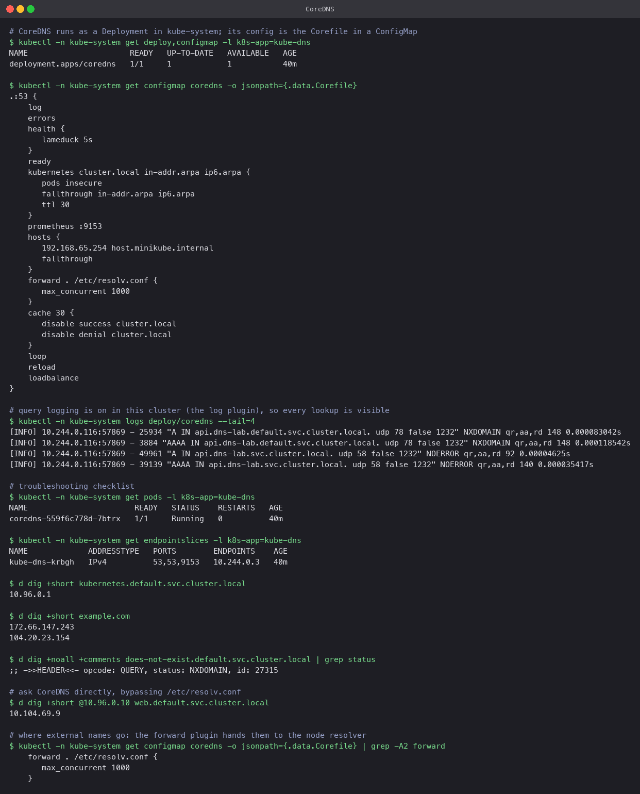

# CoreDNS

## What it is

CoreDNS is a DNS server written in Go and built from plugins. Each plugin handles one job
(serve Kubernetes records, forward upstream, cache, log) and they are chained in a config
file called the Corefile. It has been the default cluster DNS since Kubernetes 1.13, replacing
kube-dns.

## Why Kubernetes uses it

- Kubernetes needs DNS that updates the instant a Service or Pod changes. The `kubernetes`
  plugin watches the API server directly and answers from memory; nothing is written to zone
  files.
- One binary, one Pod spec, one ConfigMap. Easy to run as a Deployment and scale.
- Plugins make it extensible: add `log` for query logging, `hosts` for static entries,
  `rewrite` to alias names, or point `forward` at a corporate resolver, all by editing one
  ConfigMap.

## How service discovery works

1. The EndpointSlice controller and the Service API hold the truth about Services and Pods.
2. CoreDNS's `kubernetes` plugin watches those objects and synthesises records on demand:
   A records for ClusterIPs, A records per Pod for headless Services, SRV for named ports,
   PTR for reverse lookups, CNAME for ExternalName.
3. kubelet writes `nameserver 10.96.0.10` into every Pod's `/etc/resolv.conf`. That address
   is the `kube-dns` Service, whose EndpointSlice points at the CoreDNS Pod(s).
4. A Pod asks for `web`, the search list expands it to `web.default.svc.cluster.local`, CoreDNS
   returns the ClusterIP, kube-proxy routes the connection.

## How a query is resolved

Each query passes through the plugins in the order the Corefile lists them (actually a fixed
order compiled into CoreDNS, but the Corefile decides which are active):

```
Pod -> kube-dns Service (10.96.0.10) -> CoreDNS Pod
  log         record the query
  errors      record failures
  kubernetes  if the name ends in cluster.local: answer from the API-server cache
  hosts       static entries (Minikube adds host.minikube.internal here)
  forward     anything else goes to the node's /etc/resolv.conf upstream
  cache       cache the answer (30s here; disabled for cluster.local so changes are instant)
```

In the capture, CoreDNS's own log shows exactly this: `api.dns-lab.default.svc.cluster.local`
returned NXDOMAIN (first search domain), then `api.dns-lab.svc.cluster.local` returned
NOERROR. `example.com` was answered through `forward`.

## Configuration

The Corefile lives in the `coredns` ConfigMap in `kube-system`:

```bash
kubectl -n kube-system get configmap coredns -o yaml
kubectl -n kube-system edit configmap coredns     # the reload plugin picks changes up automatically
```

This cluster's Corefile, with what each line does:

```
.:53 {
    log                      # log every query (Minikube enables this; off by default elsewhere)
    errors                   # log errors
    health { lameduck 5s }   # /health endpoint for the liveness probe
    ready                    # /ready endpoint for the readiness probe
    kubernetes cluster.local in-addr.arpa ip6.arpa {
       pods insecure         # allow <ip-with-dashes>.<ns>.pod records
       fallthrough in-addr.arpa ip6.arpa
       ttl 30
    }
    prometheus :9153         # metrics
    hosts { 192.168.65.254 host.minikube.internal; fallthrough }
    forward . /etc/resolv.conf { max_concurrent 1000 }   # upstream for everything else
    cache 30 { disable success cluster.local; disable denial cluster.local }
    loop                     # detect forwarding loops
    reload                   # watch the Corefile for changes
    loadbalance              # shuffle A records in answers
}
```

Common edits: forward a private zone to another server (`corp.example { forward . 10.0.0.2 }`),
add a `rewrite` so an old name keeps working, or raise `cache`.

## Troubleshooting DNS

Work from the bottom up. Each step was run in the capture.

| Check | Command | Healthy answer |
|---|---|---|
| Is CoreDNS running | `kubectl -n kube-system get pods -l k8s-app=kube-dns` | `1/1 Running`, low restarts |
| Does the Service have endpoints | `kubectl -n kube-system get endpointslices -l k8s-app=kube-dns` | the CoreDNS Pod IP on ports 53 |
| Does the Pod have the right resolver | `kubectl exec <pod> -- cat /etc/resolv.conf` | `nameserver 10.96.0.10` plus the search list |
| Can the Pod resolve a known Service | `dig +short kubernetes.default.svc.cluster.local` | `10.96.0.1` |
| Can it resolve an external name | `dig +short example.com` | public IPs (tests the `forward` path) |
| Is it a real NXDOMAIN or a timeout | `dig +noall +comments <name> \| grep status` | `NXDOMAIN` means DNS works and the name is wrong; `SERVFAIL` or a timeout means DNS is broken |
| Bypass the resolver config | `dig @10.96.0.10 <name>` | same answer as without `@`; if this works but plain `dig` fails, the Pod's resolv.conf is the problem |
| What is CoreDNS seeing | `kubectl -n kube-system logs deploy/coredns` | with `log` enabled, one line per query with the response code |

Typical root causes, in rough order of frequency: a typo in the Service name or namespace
(NXDOMAIN), a Service with no ready endpoints (name resolves but connections fail, so it is
not DNS), a NetworkPolicy blocking UDP 53 to kube-system, CoreDNS Pods crash-looping because
the upstream in `forward` is unreachable (`loop` detected), or `ndots:5` causing slow lookups
of external names that a trailing dot fixes.


