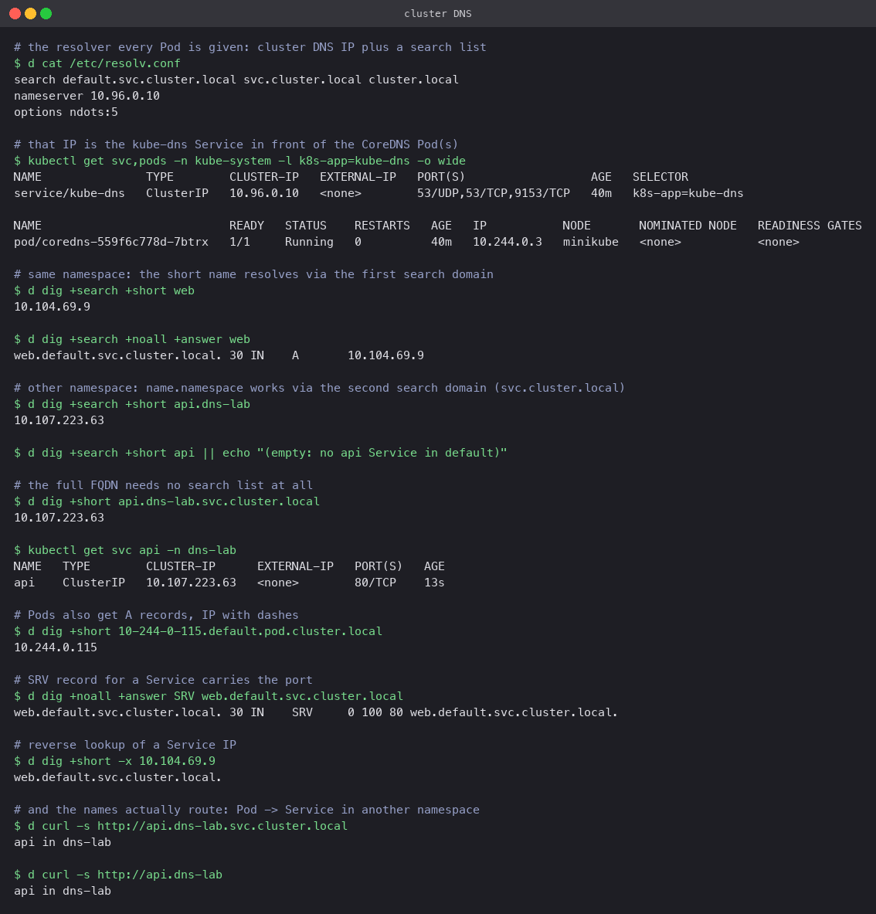

# FQDN and Kubernetes DNS

## What is an FQDN?

A fully qualified domain name is the complete, unambiguous name of a host: every label from
the host up to the DNS root, for example `api.dns-lab.svc.cluster.local`. A short name like
`api` is only meaningful relative to a search list. Resolvers append search domains to short
names until one resolves. FQDNs skip that guesswork.

## Kubernetes Service DNS

Every Service gets a DNS A record (and AAAA on dual-stack) that resolves to its ClusterIP.
Headless Services resolve to the Pod IPs instead. ExternalName Services resolve to a CNAME.
CoreDNS serves all of these from the cluster's own zone, `cluster.local` by default.

## Naming convention

```
<service>.<namespace>.svc.<cluster-domain>          A    -> ClusterIP
<pod-ip-with-dashes>.<namespace>.pod.<cluster-domain>  A -> Pod IP
_<port-name>._<protocol>.<service>.<namespace>.svc.<cluster-domain>  SRV -> port + target
<hostname>.<headless-service>.<namespace>.svc.<cluster-domain>        A -> a specific StatefulSet Pod
```

So for a Service `api` in namespace `dns-lab`, the FQDN is `api.dns-lab.svc.cluster.local`.

## Namespace-based DNS and the search list

Every Pod is handed a `/etc/resolv.conf` like this one, captured from a Pod in `default`:

```
search default.svc.cluster.local svc.cluster.local cluster.local
nameserver 10.96.0.10
options ndots:5
```

- `nameserver 10.96.0.10` is the `kube-dns` Service that fronts CoreDNS.
- The search list is namespace-specific. From `default`, the short name `web` is tried as
  `web.default.svc.cluster.local` first and resolves.
- `api.dns-lab` is tried as `api.dns-lab.default.svc.cluster.local` (fails), then
  `api.dns-lab.svc.cluster.local` (succeeds). That is why `name.namespace` reaches another
  namespace without writing the whole FQDN.
- `ndots:5` means any name with fewer than five dots goes through the search list before
  being tried as-is. External names like `example.com` therefore cost a few NXDOMAIN lookups
  first; adding a trailing dot (`example.com.`) skips the search list.

## Pod-to-Service communication

A Pod never needs a Service's IP. It uses the name, CoreDNS returns the ClusterIP, and
kube-proxy forwards the connection to a ready Pod. In the run below, a Pod in `default`
fetched `http://api.dns-lab` and `http://api.dns-lab.svc.cluster.local` and both returned
the response from the Pod in `dns-lab`.

## Examples from this cluster

| Query | Answer | Meaning |
|---|---|---|
| `dig +search web` | `web.default.svc.cluster.local. A 10.104.69.9` | Short name expanded by the search list |
| `dig +search api.dns-lab` | `10.107.223.63` | Cross-namespace via the second search domain |
| `dig api.dns-lab.svc.cluster.local` | `10.107.223.63` | FQDN, no search needed |
| `dig 10-244-0-115.default.pod.cluster.local` | `10.244.0.115` | Pod A record |
| `dig SRV web.default.svc.cluster.local` | `0 100 80 web.default.svc.cluster.local.` | Port 80 is in the SRV record |
| `dig -x 10.104.69.9` | `web.default.svc.cluster.local.` | Reverse lookup of a ClusterIP |
| `dig +search api` (from `default`) | empty | There is no `api` in `default`; search domains do not cross into `dns-lab` for bare names |

`dig` came from `bind-tools` installed in a throwaway Alpine Pod; BusyBox's `nslookup` works
too but prints every search-list attempt, which makes the output harder to read.


