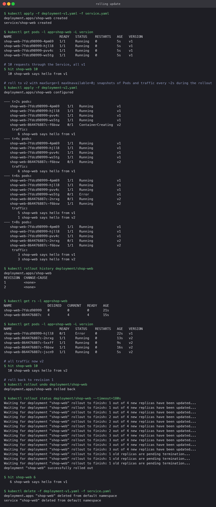

# Rolling update

The default strategy. The Deployment controller creates a new ReplicaSet for the new Pod
template and shifts replicas from the old ReplicaSet to the new one a step at a time, so
some Pods always serve.

## Manifests

`deployment-v1.yaml` and `deployment-v2.yaml` are identical except for the `version` label
and the echo text. Both set:

```yaml
strategy:
  type: RollingUpdate
  rollingUpdate:
    maxSurge: 1          # at most 1 Pod above the desired 4 during the rollout
    maxUnavailable: 0    # never fewer than 4 ready Pods
```

With these values the controller must bring a new Pod to Ready before it is allowed to remove
an old one. The `readinessProbe` on the container is what "Ready" means here; without it a
Pod counts as ready the moment the container starts, which is too early.

`service.yaml` selects `app: shop-web`, so it matches both versions and traffic shifts as the
Pod set changes.

## Commands

```bash
kubectl apply -f deployment-v1.yaml -f service.yaml
kubectl rollout status deployment/shop-web
kubectl get pods -l app=shop-web -L version

kubectl apply -f deployment-v2.yaml          # triggers the rollout
kubectl get pods -l app=shop-web -L version  # repeat during the rollout
kubectl rollout history deployment/shop-web
kubectl get rs -l app=shop-web

kubectl rollout undo deployment/shop-web
```

## What the run showed

- Before: four v1 Pods, ten requests all answered by v1.
- Two seconds after applying v2, a fifth Pod (v2) was `ContainerCreating` while all four v1
  Pods still ran. That is `maxSurge: 1`.
- Once that v2 Pod passed readiness, one v1 Pod was terminated and a second v2 Pod started.
  The traffic sample at that moment was a mix: 5 v1, 1 v2, then 3 and 3. Both versions served
  at the same time, which is the one thing to keep in mind with this strategy.
- After the rollout: the old ReplicaSet shows `0/0/0`, the new one `4/4/4`, and `rollout history`
  lists two revisions. Ten requests all answered by v2.
- `kubectl rollout undo` ran the same process in reverse and traffic returned to v1.

Pause, resume and targeted rollbacks are available too:
`kubectl rollout pause|resume deployment/shop-web`, `kubectl rollout undo --to-revision=N`.


