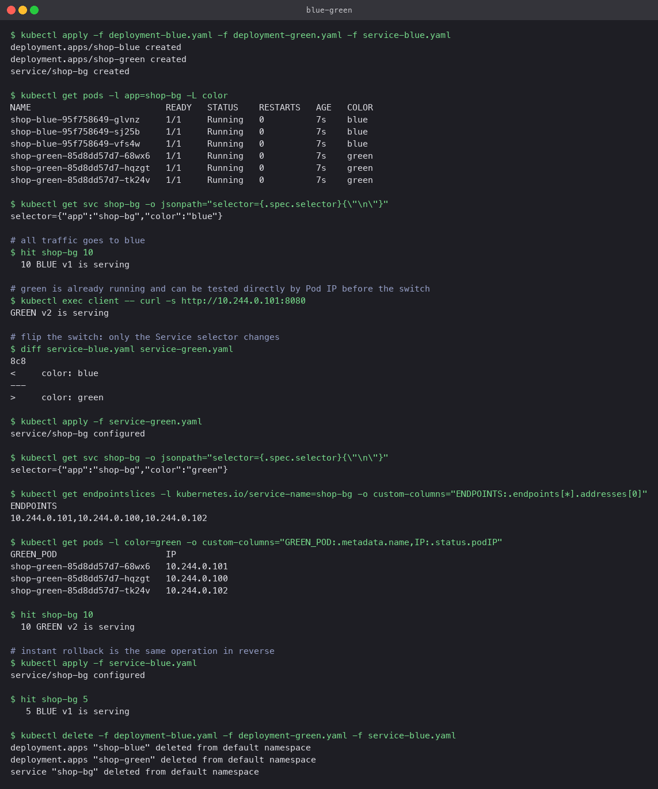

# Blue-green

Two complete copies of the application run side by side. "Blue" is live; "green" is the new
version, fully started and testable but receiving no user traffic. Cutover is a single change
to the Service's label selector. Rollback is the same change in reverse.

## Manifests

- `deployment-blue.yaml`: 3 replicas, labels `app: shop-bg, color: blue`
- `deployment-green.yaml`: 3 replicas, labels `app: shop-bg, color: green`
- `service-blue.yaml` and `service-green.yaml`: the same Service `shop-bg`, differing only
  in `selector.color`

```diff
<     color: blue
---
>     color: green
```

## Commands

```bash
kubectl apply -f deployment-blue.yaml -f deployment-green.yaml -f service-blue.yaml
kubectl get pods -l app=shop-bg -L color
kubectl get svc shop-bg -o jsonpath='{.spec.selector}'

# test green directly by Pod IP before anyone else sees it
kubectl exec client -- curl -s http://<green-pod-ip>:8080

kubectl apply -f service-green.yaml      # cutover
kubectl get endpointslices -l kubernetes.io/service-name=shop-bg
kubectl apply -f service-blue.yaml       # rollback
```

## What the run showed

- Six Pods ran from the start, three of each colour. With the blue selector, ten requests were
  all `BLUE v1 is serving`.
- The green Pods were reachable by IP and answered `GREEN v2 is serving`, so they could be
  smoke-tested before cutover.
- After applying the green selector, the EndpointSlice listed exactly the three green Pod IPs
  and ten requests were all `GREEN v2`. No request was served by a mix of versions.
- Applying the blue selector again put all traffic back on blue within a few seconds.

The cost is running twice the Pods during the transition. The benefit is that old and new
never serve simultaneously, and rollback does not involve rescheduling anything.


