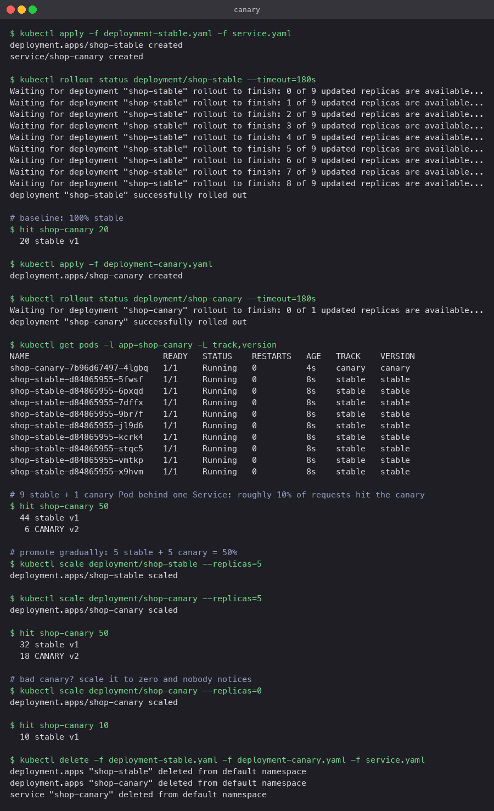

# Canary

A small number of new-version Pods join the existing Pods behind one Service, so a fraction of
real traffic exercises the new code while most users stay on the stable version. If it
misbehaves, scaling the canary Deployment to zero removes it without touching stable.

## Manifests

- `deployment-stable.yaml`: 9 replicas, labels `app: shop-canary, track: stable`
- `deployment-canary.yaml`: 1 replica, labels `app: shop-canary, track: canary`
- `service.yaml`: selects only `app: shop-canary`, so it matches both tracks

The `track` label is for people and for `kubectl get -L track`. The Service does not use it.

## Traffic split

A plain Service spreads connections roughly evenly over its ready endpoints, so the split is
set by replica counts, not by configuration:

| stable | canary | canary share |
|---|---|---|
| 9 | 1 | ~10% |
| 5 | 5 | ~50% |
| 0 | 10 | 100% |

## Commands

```bash
kubectl apply -f deployment-stable.yaml -f service.yaml
kubectl apply -f deployment-canary.yaml
kubectl get pods -l app=shop-canary -L track,version

kubectl scale deployment/shop-stable --replicas=5
kubectl scale deployment/shop-canary --replicas=5

kubectl scale deployment/shop-canary --replicas=0     # abort
```

## What the run showed

- Baseline: 20 requests, all `stable v1`.
- With 9 stable + 1 canary, 50 requests split 44 to 6. Close to the 10% target; the spread is
  statistical, not exact.
- With 5 and 5, the split was 32 to 18. Again roughly the expected ratio over a small sample.
- Scaling the canary to 0 returned 10 of 10 requests to stable immediately.

For exact percentages (say 2% of traffic) you need something that routes by weight rather than
by Pod count: an Ingress controller with weighted backends, a service mesh, or Argo Rollouts.


