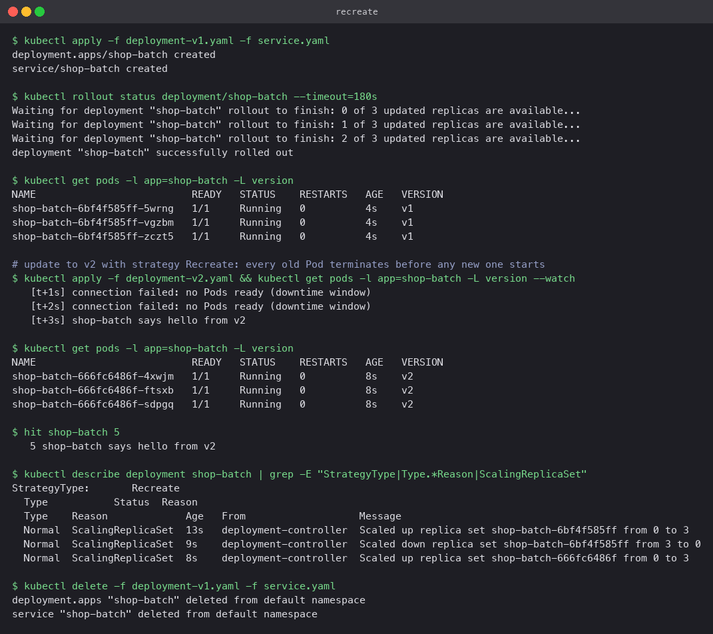

# Recreate

`strategy.type: Recreate` scales the old ReplicaSet to zero, waits for every old Pod to be
gone, and only then scales the new ReplicaSet up. There is a window with no Pods at all.

## When that is acceptable

- The two versions cannot coexist: an incompatible database schema change, a single-writer
  lock, a licence that allows one instance.
- The Pod mounts a `ReadWriteOnce` volume that only one Pod may attach.
- Dev or test environments where a few seconds of downtime is cheaper than extra capacity.

## Manifests

`deployment-v1.yaml` and `deployment-v2.yaml` differ only in the version label and echo text.
Both set:

```yaml
strategy:
  type: Recreate
```

## Commands

```bash
kubectl apply -f deployment-v1.yaml -f service.yaml
kubectl apply -f deployment-v2.yaml
kubectl get pods -l app=shop-batch -L version     # repeat quickly
kubectl exec client -- curl -s -m 2 http://shop-batch
kubectl describe deployment shop-batch | grep -E "StrategyType|ScalingReplicaSet"
```

## What the run showed

- Three v1 Pods running, then `apply` of v2.
- For the next two seconds `curl` to the Service failed: there were no ready endpoints. That is
  the downtime window.
- At three seconds the first v2 Pod answered. Shortly after, three v2 Pods were running.
- The Deployment events spell out the order: `Scaled down replica set ... from 3 to 0`, then
  `Scaled up replica set ... from 0 to 3`. Compare with rolling update, where the two scale
  operations interleave.


