# Pod lifecycle

A Pod's `status.phase` is one of `Pending`, `Running`, `Succeeded`, `Failed` or `Unknown`.
The `STATUS` column in `kubectl get pods` is more specific: it shows the container's waiting
reason (`ContainerCreating`, `CrashLoopBackOff`, `ImagePullBackOff`) or terminated reason
(`Completed`, `Error`) when there is one. Each manifest below drives a Pod into one of those
states on purpose. For each: the manifest, what was run, what `kubectl` showed, and why.

Every scenario was checked with the same three commands:

```bash
kubectl apply -f <file>
kubectl get pod <name>            # or -o wide, -o jsonpath=...
kubectl describe pod <name>       # the Events section at the end is the useful part
```

## 01 Running

`01-running.yaml`: a plain nginx container.

Phase `Running`, `READY 1/1`, state `running` with a start time. Events: `Scheduled`,
`Pulled`, `Created`, `Started`. This is the baseline every other scenario deviates from.

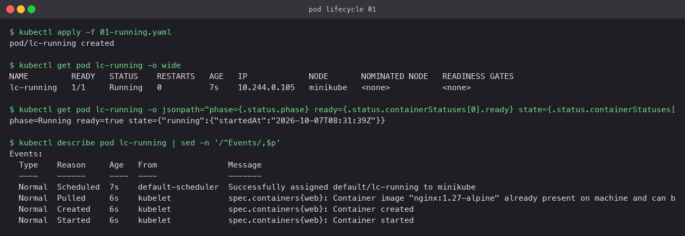

## 02 Pending

`02-pending.yaml`: requests 16 CPU and 64Gi memory, more than the node has.

Phase stays `Pending` with no node assigned. The `PodScheduled` condition is `False`, reason
`Unschedulable`, and the event says `0/1 nodes are available: 1 Insufficient cpu, 1 Insufficient
memory`. Nothing is wrong with the image or the container; the scheduler simply has nowhere to
put it. Fix by lowering the request or adding capacity.

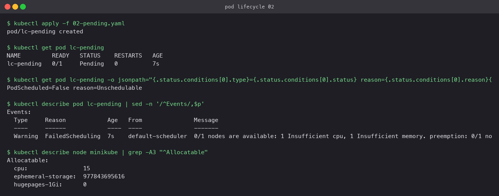

## 03 Succeeded and 04 Failed

`03-succeeded.yaml` runs `exit 0`; `04-failed.yaml` runs `exit 1`. Both have
`restartPolicy: Never`.

The first ends in `Completed` with `exitCode=0 reason=Completed`. The second ends in `Error`
with `exitCode=1 reason=Error`. Logs are still available from both after they stop, which is
how you find out *why* a one-shot Pod failed. With the default `restartPolicy: Always` the
failed one would have become scenario 05 instead.

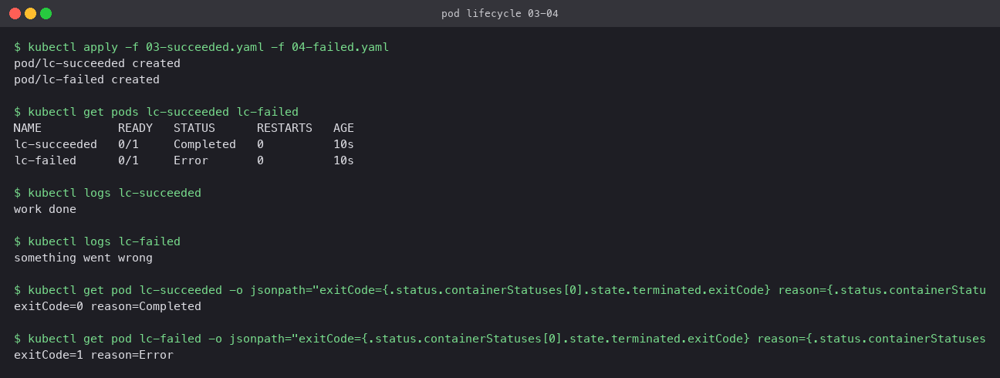

## 05 CrashLoopBackOff and 06 ImagePullBackOff

`05-crashloopbackoff.yaml`: exits 1 after two seconds, default restart policy.
`06-imagepullbackoff.yaml`: image tag that does not exist.

The crashing container is restarted by kubelet each time with a growing delay (10s, 20s, 40s,
up to five minutes). `RESTARTS` climbs and the status alternates between `Error` and
`CrashLoopBackOff`. The `BackOff` event appears with `(x3 over 43s)`. `kubectl logs --previous`
shows the output of the last crashed attempt.

The bad image never gets as far as a container. Events cycle `Pulling`, `Failed` with the
registry's `not found` message, then `BackOff pulling image`. Status shows `ErrImagePull` for
a moment and `ImagePullBackOff` between attempts. The fix is in the manifest, not the cluster.

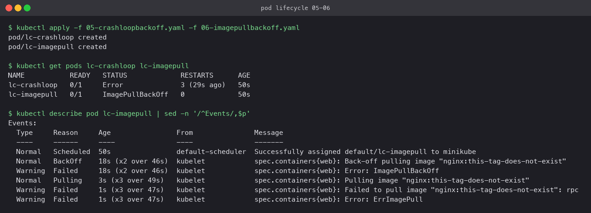

## 07 Readiness probe

`07-readiness.yaml`: the container sleeps 20s, then creates `/tmp/ready`. The readiness
probe runs `cat /tmp/ready` every 3s.

For the first 20s the Pod is `Running` but `READY 0/1`. A Service pointing at it had an
EndpointSlice entry with `ready: false`, meaning no traffic would be routed to it. After the
file appeared, `READY 1/1` and the endpoint flipped to `ready: true`. Readiness never restarts
anything; it only controls whether the Pod receives Service traffic.

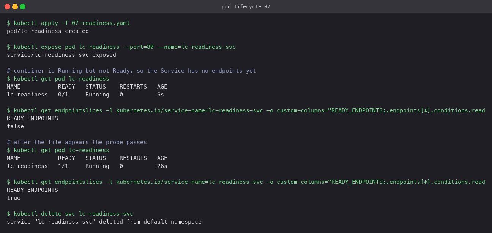

## 08 Liveness probe

`08-liveness.yaml`: the container creates `/tmp/healthy`, deletes it after 15s, then idles.
The liveness probe runs `cat /tmp/healthy` every 3s with `failureThreshold: 3`.

About 25s in, events show `Liveness probe failed` three times followed by `Killing ...
Container app failed liveness probe, will be restarted`. The container restarts inside the
same Pod (same name, same IP). Liveness is for "the process is up but wedged" situations; a
restart is the remedy.

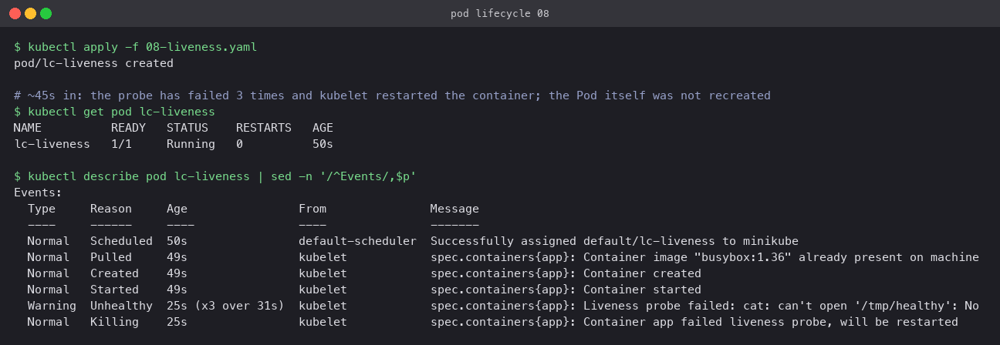

## 09 Startup probe

`09-startup.yaml`: the app takes 25s to create `/tmp/started`. The startup probe allows
10 attempts at 5s intervals; the liveness probe has `failureThreshold: 1`.

While the startup probe is failing (`Startup probe failed (x5 over 44s)`), the liveness probe
is not run at all, so the strict liveness setting cannot kill the slow-starting container.
Once startup passed, the Pod went `READY 1/1` with `RESTARTS 0`. Without the startup probe,
liveness would have restarted this container every 5s forever.

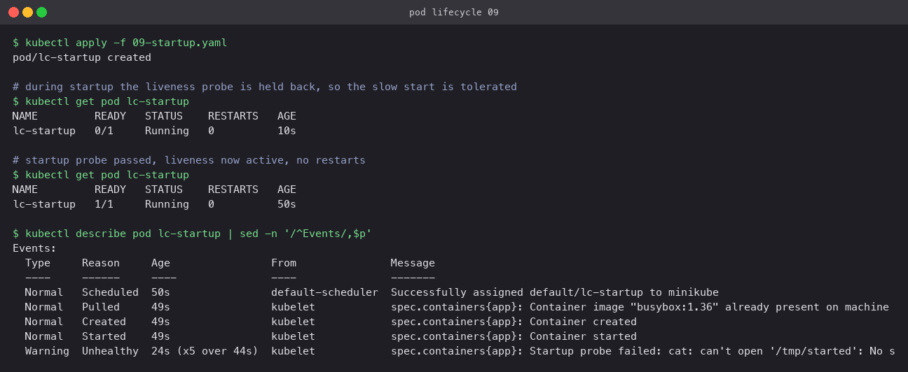

## 10 Init container

`10-init-container.yaml`: an init container writes `index.html` into an `emptyDir`, sleeps 8s
and exits. The nginx container mounts the same volume.

Status showed `Init:0/1` while the init step ran. Events list the init container's
`Pulled/Created/Started` first and nginx's only afterwards, nine seconds later. The page nginx
served was the one the init container wrote. Init containers run in order, must exit 0, and
finish before any app container starts.

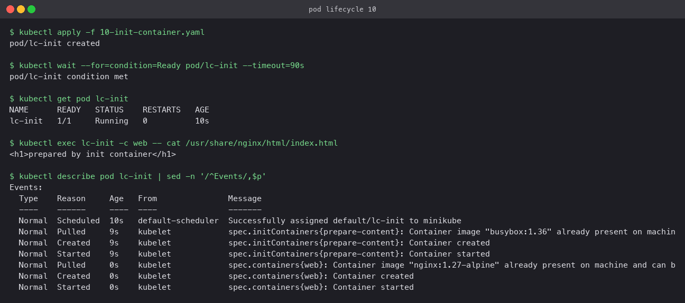

## 11 Multi-container Pod

`11-multi-container.yaml`: nginx plus a sidecar that writes the current time into a shared
`emptyDir` every 5s.

`READY 2/2`, one Pod IP. Reading the file from the nginx container returned a timestamp that
changed between two reads. The sidecar fetched `http://127.0.0.1:80` and got the same content,
which demonstrates the shared network namespace: containers in one Pod talk over localhost.

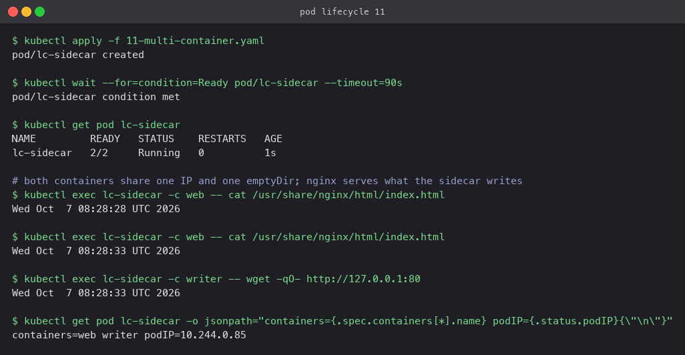

## 12 Graceful termination

`12-termination.yaml`: `terminationGracePeriodSeconds: 20`, a `preStop` hook, and a shell
that traps `SIGTERM`, logs, sleeps 5s and exits 0.

After `kubectl delete`, the Pod showed `Terminating` while kubelet ran the preStop hook, sent
`SIGTERM`, and waited. The logs captured `SIGTERM received, finishing in-flight work`. The Pod
was gone a few seconds later, well inside the grace period, so `SIGKILL` was never needed.
An app that ignores `SIGTERM` would be killed at the 20s mark.

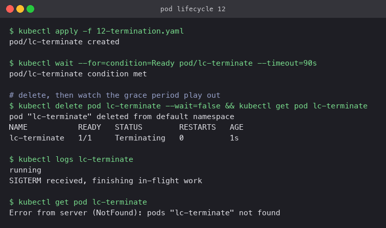

## All scenarios side by side

Taken while most of the Pods above were still live:

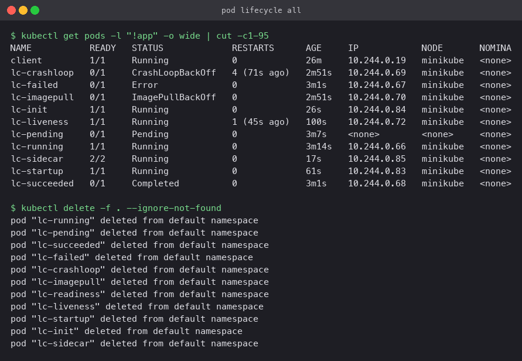

## Cleanup

```bash
kubectl delete -f .
```
